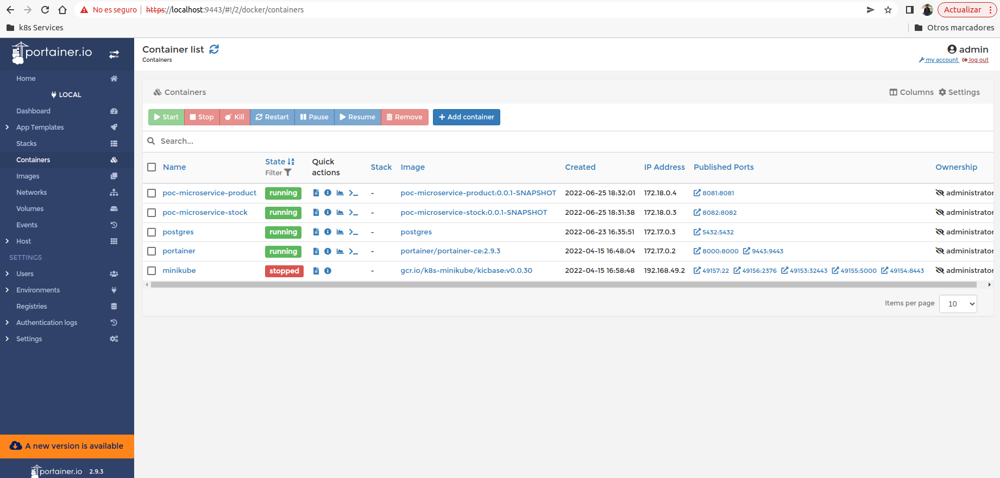
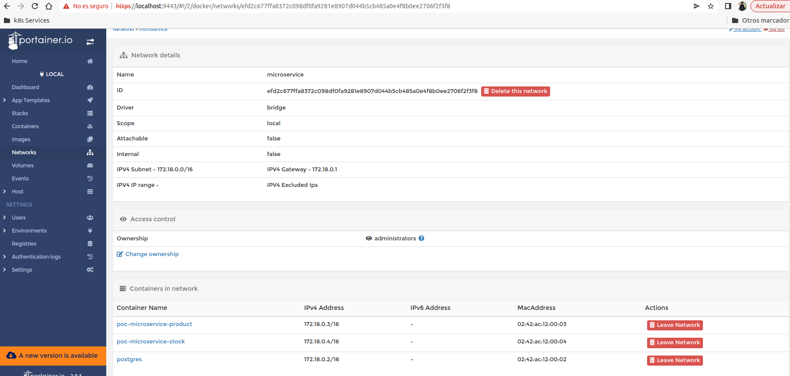

## Description
PoC Microservice Stock

## Swagger UI
[Stock Swagger UI](http://localhost:8082/api/swagger-ui/index.html)

## Build Docker image
```shell
docker build -t poc-microservice-stock:0.0.1-SNAPSHOT .
```

## Run Docker image
Create network

```shell
docker network create microservice
```

Run image

```shell
docker run --rm --name poc-microservice-stock -p 8082:8082 --network microservice poc-microservice-stock:0.0.1-SNAPSHOT
```




